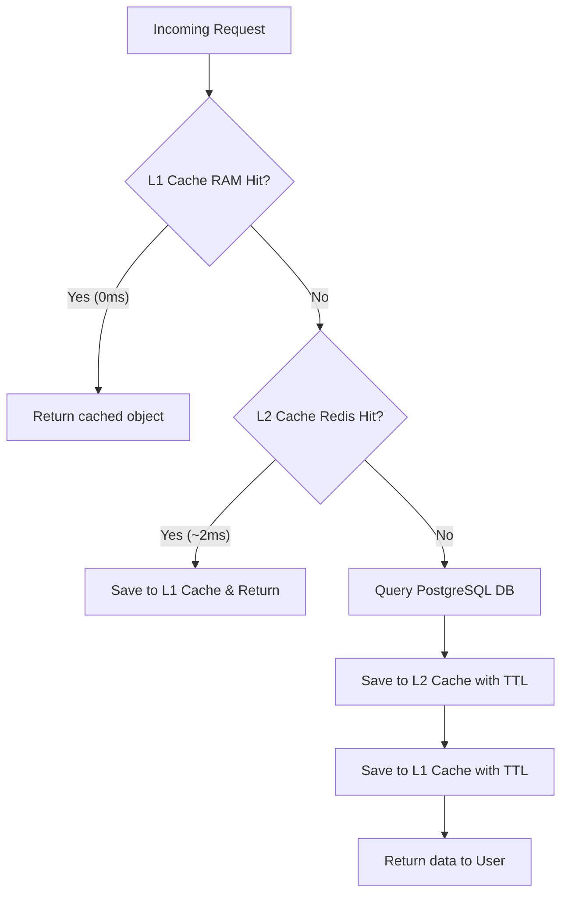

# Redis & In-Memory Hybrid Caching Implementation Plan

This document outlines the design and step-by-step implementation steps to introduce a high-performance **Hybrid L1/L2 Caching Layer** for read-heavy operations in the Telegram bot.

By combining an in-process memory cache (**L1 RAM**) with a shared network cache (**L2 Redis**), database query latencies will drop from **400ms+ (Postgres RTT)** to **0.001ms (RAM)** and **under 5ms (Redis)**.

---

## 1. Core Pattern: Hybrid L1/L2 Caching (Cache-Aside)

For all read operations, the application query follows this hierarchy:
1. **L1 Cache (In-Memory RAM)**: Checked first. Fast lookup without network calls (takes ~0.001ms).
2. **L2 Cache (Redis)**: Checked next. Shared cache across server instances (~2ms).
3. **Database (PostgreSQL)**: Fallback on miss. Writes back to both L2 and L1.



---

## 2. Key Schemas & TTL Configurations

To prevent memory bloat and handle data changes gracefully, cached keys must have explicit expirations:

| Cache Key Pattern | Recommended L1 TTL (RAM) | Recommended L2 TTL (Redis) | Invalidation Trigger |
| :--- | :--- | :--- | :--- |
| `cache:user:profile:{telegram_id}` | 1 minute | 1 hour | `create_user`, `add_xp_coins`, `update_reminder_setting` |
| `cache:group:settings:{group_id}:{name}` | 1 minute | 10 minutes | `set_group_setting` |
| `cache:group:mute:{group_id}:{telegram_id}` | 1 minute | 10 minutes | `mute_group_battle` |
| `cache:linked_account:{telegram_id}` | 5 minutes | 1 hour | `link_leetcode_account`, `verify_leetcode_account` |

---

## 3. Step-by-Step Code Implementation Guide

All changes can be centralized inside `src/services/supabase_db.py` to ensure other handlers continue calling the database service seamlessly.

### Step 1: Install Dependencies & Import Cache Modules
Make sure `cachetools` is in your virtual environment dependencies (`requirements.txt`).
Add the following imports and initialize the L1 caches in the `SupabaseDB` constructor:

```python
# In src/services/supabase_db.py
import json
from cachetools import TTLCache
from src.services.redis_cache import cache_manager

# Inside class SupabaseDB:
# Add constructor or initialize L1 caches:
def __init__(self):
    super().__init__()
    # Store up to 1024 settings/profiles locally in RAM with short expirations
    self.l1_settings_cache = TTLCache(maxsize=1024, ttl=60)
    self.l1_profile_cache = TTLCache(maxsize=1024, ttl=60)
    self.l1_mute_cache = TTLCache(maxsize=1024, ttl=60)
```

---

### Step 2: Wrap Database Read Queries (L1 & L2 Integrated)

Modify read functions to check L1, then L2, then fallback to Postgres.

#### A. Optimizing `get_group_setting`
```python
async def get_group_setting(self, group_id: int, setting_name: str) -> Optional[str]:
    cache_key = f"cache:group:settings:{group_id}:{setting_name}"
    
    # 1. L1 RAM Cache Hit (Fastest)
    if cache_key in self.l1_settings_cache:
        return self.l1_settings_cache[cache_key]

    # 2. L2 Redis Cache Hit
    try:
        cached_value = await cache_manager.get(cache_key)
        if cached_value is not None:
            # Store in L1 RAM cache before returning
            self.l1_settings_cache[cache_key] = cached_value
            return cached_value
    except Exception as e:
        logger.error(f"Redis L2 cache read error in get_group_setting: {e}")

    # 3. L1/L2 Cache Miss -> Query PostgreSQL DB
    row = await self.fetchrow(
        "SELECT setting_value FROM group_settings WHERE group_id = $1 AND setting_name = $2",
        group_id, setting_name
    )
    val = row["setting_value"] if row else None

    # 4. Save to both L1 RAM and L2 Redis
    if val is not None:
        self.l1_settings_cache[cache_key] = val
        try:
            await cache_manager.set(cache_key, val, ex=600)  # L2 TTL: 10 mins
        except Exception as e:
            logger.error(f"Redis L2 cache write error in get_group_setting: {e}")
            
    return val
```

#### B. Optimizing `get_user`
```python
async def get_user(self, telegram_id: int) -> Optional[Dict[str, Any]]:
    cache_key = f"cache:user:profile:{telegram_id}"
    
    # 1. L1 RAM Cache Hit
    if cache_key in self.l1_profile_cache:
        return self.l1_profile_cache[cache_key]

    # 2. L2 Redis Cache Hit
    try:
        cached_data = await cache_manager.get(cache_key)
        if cached_data:
            user_dict = json.loads(cached_data)
            self.l1_profile_cache[cache_key] = user_dict
            return user_dict
    except Exception as e:
        logger.error(f"Redis L2 cache read error in get_user: {e}")

    # 3. Cache Miss -> Query PostgreSQL DB
    row = await self.fetchrow("SELECT * FROM users WHERE telegram_id = $1", telegram_id)
    user_dict = dict(row) if row else None

    # 4. Save to both L1 RAM and L2 Redis
    if user_dict:
        self.l1_profile_cache[cache_key] = user_dict
        try:
            await cache_manager.set(cache_key, json.dumps(user_dict, default=str), ex=3600)  # L2 TTL: 1 hour
        except Exception as e:
            logger.error(f"Redis L2 cache write error in get_user: {e}")

    return user_dict
```

---

### Step 3: Implement Cache Invalidation (Write Operations)

Whenever data changes, you must immediately invalidate **both** the L1 RAM and L2 Redis keys.

#### A. Invalidating Group Settings in `set_group_setting`
```python
async def set_group_setting(self, group_id: int, setting_name: str, setting_value: str):
    query = """
    INSERT INTO group_settings (group_id, setting_name, setting_value)
    VALUES ($1, $2, $3)
    ON CONFLICT (group_id, setting_name)
    DO UPDATE SET setting_value = EXCLUDED.setting_value
    """
    await self.execute(query, group_id, setting_name, setting_value)
    
    cache_key = f"cache:group:settings:{group_id}:{setting_name}"
    
    # Invalidate L1 Cache (RAM)
    self.l1_settings_cache.pop(cache_key, None)
    
    # Invalidate L2 Cache (Redis)
    try:
        await cache_manager.delete(cache_key)
    except Exception as e:
        logger.error(f"Failed to invalidate L2 cache key {cache_key}: {e}")
```

#### B. Invalidating User Settings in `update_reminder_setting`
```python
async def update_reminder_setting(self, telegram_id: int, setting_name: str, value: bool) -> Optional[Dict[str, Any]]:
    if setting_name not in ["remind_daily", "remind_streak", "remind_contests"]:
        raise ValueError(f"Invalid setting name: {setting_name}")
    
    query = f"""
    UPDATE users
    SET {setting_name} = $2
    WHERE telegram_id = $1
    RETURNING *
    """
    row = await self.fetchrow(query, telegram_id, value)
    
    cache_key = f"cache:user:profile:{telegram_id}"
    
    # Invalidate L1 RAM
    self.l1_profile_cache.pop(cache_key, None)
    
    # Invalidate L2 Redis
    try:
        await cache_manager.delete(cache_key)
    except Exception as e:
        logger.error(f"Failed to invalidate L2 cache key {cache_key}: {e}")
        
    return dict(row) if row else None
```

#### C. Invalidating Mutes in `mute_group_battle`
```python
async def mute_group_battle(self, group_id: int, telegram_id: int, mute: bool):
    if mute:
        await self.execute(
            "INSERT INTO group_battle_mutes (group_id, telegram_id) VALUES ($1, $2) ON CONFLICT (group_id, telegram_id) DO NOTHING",
            group_id, telegram_id
        )
    else:
        await self.execute(
            "DELETE FROM group_battle_mutes WHERE group_id = $1 AND telegram_id = $2",
            group_id, telegram_id
        )
        
    cache_key = f"cache:group:mute:{group_id}:{telegram_id}"
    
    # Invalidate L1 RAM
    self.l1_mute_cache.pop(cache_key, None)
    
    # Invalidate L2 Redis
    try:
        await cache_manager.delete(cache_key)
    except Exception as e:
        logger.error(f"Failed to invalidate L2 cache key {cache_key}: {e}")
```

---

## 4. Verification and Debugging

To confirm the cache is working correctly after implementation:

1. **Check L1 Performance**:
   * Measure code execution times on `get_group_setting` lookup. On L1 cache hits, execution time should be `< 0.05ms`.
2. **Check Redis Live Commands Count**:
   * Inspect the Upstash metrics. If a cache miss occurs in L1, you will see a `GET` command sent to Redis (L2).
3. **Verify Graceful Fallback**:
   * The `try-except` blocks protect the bot from crashes. If Redis goes down, the bot will drop back to pure SQL querying automatically.
