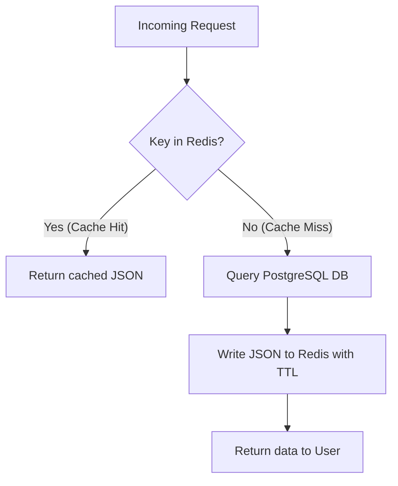

# Redis Caching Implementation Plan

This document outlines the design and step-by-step implementation steps to introduce a high-performance Redis caching layer for read-heavy operations in the Telegram bot. By implementing this cache-aside pattern, database query latencies will drop from **400ms+ (Postgres RTT)** to **under 10ms (Redis RTT)**.

---

## 1. Core Pattern: Cache-Aside (Read-Through)
For all read operations, the application should query Redis first. Only if the key is missing (cache miss) should it fallback to PostgreSQL, query the database, write the result back to Redis with a Time-To-Live (TTL), and return the data.



---

## 2. Key Schemas & TTL Configurations

To prevent memory bloat and handle data changes gracefully, all cached keys must have an explicit TTL:

| Cache Key Pattern | Cached Data Type | Recommended TTL | Invalidation Trigger |
| :--- | :--- | :--- | :--- |
| `cache:user:profile:{telegram_id}` | JSON string of user details | 1 hour | `create_user`, `add_xp_coins`, `update_reminder_setting` |
| `cache:group:settings:{group_id}:{name}` | String value of setting | 10 minutes | `set_group_setting` |
| `cache:group:mute:{group_id}:{telegram_id}` | Boolean string (`true`/`false`) | 10 minutes | `mute_group_battle` |
| `cache:linked_account:{telegram_id}` | JSON string of link | 1 hour | `link_leetcode_account`, `verify_leetcode_account` |

---

## 3. Step-by-Step Code Implementation Guide

All changes can be centralized inside `src/services/supabase_db.py` to ensure other handlers continue calling the database service seamlessly.

### Step 1: Import the Cache Manager
At the top of [src/services/supabase_db.py](file:///d:/Projects/memoize-tgbot/src/services/supabase_db.py), import the global `cache_manager` (which wraps your connection pool and JSON serialization helpers):

```python
import json
from src.services.redis_cache import cache_manager
```

### Step 2: Wrap Database Read Queries

Modify read functions to check Redis first.

#### A. Optimizing `get_group_setting`
```python
async def get_group_setting(self, group_id: int, setting_name: str) -> Optional[str]:
    cache_key = f"cache:group:settings:{group_id}:{setting_name}"
    
    # 1. Try fetching from Redis
    try:
        cached_value = await cache_manager.get(cache_key)
        if cached_value is not None:
            return cached_value
    except Exception as e:
        logger.error(f"Redis cache read error in get_group_setting: {e}")

    # 2. Cache miss -> query Postgres
    row = await self.fetchrow(
        "SELECT setting_value FROM group_settings WHERE group_id = $1 AND setting_name = $2",
        group_id, setting_name
    )
    val = row["setting_value"] if row else None

    # 3. Write back to Redis (TTL: 10 minutes / 600s)
    if val is not None:
        try:
            await cache_manager.set(cache_key, val, ex=600)
        except Exception as e:
            logger.error(f"Redis cache write error in get_group_setting: {e}")
            
    return val
```

#### B. Optimizing `get_user`
```python
async def get_user(self, telegram_id: int) -> Optional[Dict[str, Any]]:
    cache_key = f"cache:user:profile:{telegram_id}"
    
    # 1. Try fetching from Redis
    try:
        cached_data = await cache_manager.get(cache_key)
        if cached_data:
            return json.loads(cached_data)
    except Exception as e:
        logger.error(f"Redis cache read error in get_user: {e}")

    # 2. Cache miss -> query Postgres
    row = await self.fetchrow("SELECT * FROM users WHERE telegram_id = $1", telegram_id)
    user_dict = dict(row) if row else None

    # 3. Write back to Redis (TTL: 1 hour / 3600s)
    if user_dict:
        try:
            # Safely encode datetime objects if any exist in user profile columns
            await cache_manager.set(cache_key, json.dumps(user_dict, default=str), ex=3600)
        except Exception as e:
            logger.error(f"Redis cache write error in get_user: {e}")

    return user_dict
```

---

### Step 3: Implement Cache Invalidation (Write Operations)

Whenever a state modification occurs, the cached key **must** be deleted/invalidated so subsequent requests query the updated database state.

#### A. Invalidating Group Settings in `set_group_setting`
```python
async def set_group_setting(self, group_id: int, setting_name: str, setting_value: str):
    query = """
    INSERT INTO group_settings (group_id, setting_name, setting_value)
    VALUES ($1, $2, $3)
    ON CONFLICT (group_id, setting_name)
    DO UPDATE SET setting_value = EXCLUDED.setting_value
    """
    await self.execute(query, group_id, setting_name, setting_value)
    
    # Invalidate cache key
    cache_key = f"cache:group:settings:{group_id}:{setting_name}"
    try:
        await cache_manager.delete(cache_key)
    except Exception as e:
        logger.error(f"Failed to invalidate cache key {cache_key}: {e}")
```

#### B. Invalidating User Settings in `update_reminder_setting`
```python
async def update_reminder_setting(self, telegram_id: int, setting_name: str, value: bool) -> Optional[Dict[str, Any]]:
    if setting_name not in ["remind_daily", "remind_streak", "remind_contests"]:
        raise ValueError(f"Invalid setting name: {setting_name}")
    
    query = f"""
    UPDATE users
    SET {setting_name} = $2
    WHERE telegram_id = $1
    RETURNING *
    """
    row = await self.fetchrow(query, telegram_id, value)
    
    # Invalidate cached profile
    cache_key = f"cache:user:profile:{telegram_id}"
    try:
        await cache_manager.delete(cache_key)
    except Exception as e:
        logger.error(f"Failed to invalidate cache key {cache_key}: {e}")
        
    return dict(row) if row else None
```

#### C. Invalidating Mutes in `mute_group_battle`
```python
async def mute_group_battle(self, group_id: int, telegram_id: int, mute: bool):
    if mute:
        await self.execute(
            "INSERT INTO group_battle_mutes (group_id, telegram_id) VALUES ($1, $2) ON CONFLICT (group_id, telegram_id) DO NOTHING",
            group_id, telegram_id
        )
    else:
        await self.execute(
            "DELETE FROM group_battle_mutes WHERE group_id = $1 AND telegram_id = $2",
            group_id, telegram_id
        )
        
    # Invalidate mute cache key
    cache_key = f"cache:group:mute:{group_id}:{telegram_id}"
    try:
        await cache_manager.delete(cache_key)
    except Exception as e:
        logger.error(f"Failed to invalidate cache key {cache_key}: {e}")
```

---

## 4. Verification and Debugging

To confirm the cache is working correctly after implementation:

1. **Check Redis Live Commands Count**:
   * Open the Upstash console. Run `/ping` or trigger commands. You should see a high ratio of `GET` commands to Postgres requests, meaning the cache is hitting.
2. **Measure Bot Latency**:
   * Deploy the changes and run `/ping`. The database call latency will register near **0-2ms** if a cache hit occurred in Redis.
3. **Monitor Logs**:
   * We wrap all Redis cache operations with `try-except` blocks. If Redis goes down, the bot falls back gracefully to SQL querying automatically (fail-safe).
